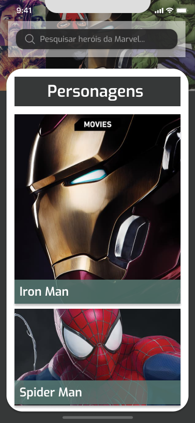

# Marvel Heroes

<center>

</center>
<br />
<br />

Esta é uma aplicação mobile que consulta API da Marvel para pesquisa de heróis. Esse projeto foi criado com uma estrutura clara e independente, conhecida como Clean Architecture, para distribuir as responsabilidades em diferentes camadas. Ele segue os princípios do SOLID, DRY, YAGNI e KISS, e utiliza padrões de design para solucionar problemas comuns. Em resumo, esse projeto possui uma arquitetura bem organizada e modular, com foco na reutilização de código e simplicidade, aplicando boas práticas de desenvolvimento.

## 🚀 Tecnologias

Esse projecto foi desenvolvido com as seguintes tecnologias:

- [React Native](https://reactnative.dev)
- [Expo](https://expo.dev)
- [Typescript](https://www.typescriptlang.org/)
- [Styled components](https://styled-components.com/)
- [Figma](https://www.figma.com/)

#

## 🖌️ Layout do projecto no Figma

- [Aceder o layout aqui](https://www.figma.com/file/pCC3rcX8rC7y2I0s7LT9WN/Marvel-heroes?type=design&node-id=43-2&mode=design&t=uLTbevAOUeRKUorL-0)

## Como baixar/executar o projecto em sua máquina

- Baixe/clone o projecto executando o comando

```
git clone https://github.com/samuelfreitas-ao/marvel-heroes-app.git
```

- Acede a pasta do projecto e instale as dependências:

```
npm install
```

- Faça uma cópia do arquivo `.env.example` para `.env` na raiz do projecto e preencha corretamente a variável `MARVEL_PUBLIC_KEY` e `MARVEL_PRIVATE_KEY` com as chaves da api da Marvel ([https://developer.marvel.com](https://developer.marvel.com)).

- Para iniciar projecto execute o comando:

```
npm run start
```

- Pressione a letra `a` para abrir o emulador Android ou faça o scan com o [expo go](https://expo.dev/client) instalado no seu telefone.
- Este projecto também tem uma versão web. [Acede a versão web AQUI](https://github.com/samuelfreitas-ao/marvel-heroes-web).
